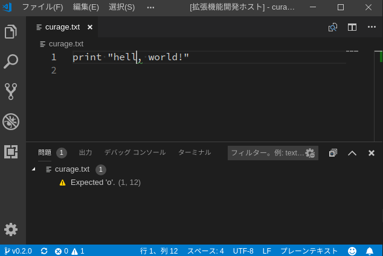
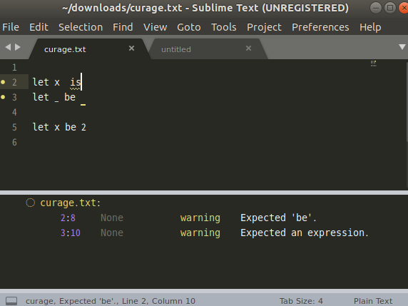
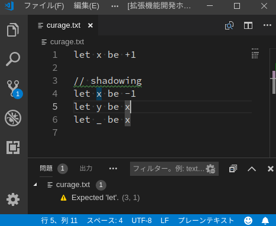

# CURAGE-LANG

This project is my study for language server protocol (LSP) server implementation.

Curage-lang itself is tiny, no-interesting language. I am implementing a LSP server for the language. It has some features, such as syntax error reporting, symbol renaming, etc.

## Structure

- `lsp`: The language server implementation and VSCode extension.
    - `src/extension.ts`: Entry point of the VSCode extension.
    - `src/server.ts`: Entry point of the server.

## Syntax

Curage-lang's syntax is very simple. The following describes the syntax in PEG-like notation.

```fsharp
expression = int / name

statement = "let" name "be" expression "\n"

program = statement*
```

Legends:

- `A*` means a sequence of A or empty,
- `A+` means a sequence of A at least one,
- `A / B` means A or B.

Example:

```curage
let x be 1
let y be x
```

## Tags and Features

- [v0.1.0](https://github.com/vain0x/curage-lang/tree/v0.1.0) ([diff](https://github.com/vain0x/curage-lang/compare/v0.0.0...v0.1.0)): Minimum implementation of LSP server
- [v0.2.0](https://github.com/vain0x/curage-lang/tree/v0.2.0) ([diff](https://github.com/vain0x/curage-lang/compare/v0.1.0...v0.2.0)): Sample of error reporting
- [v0.3.0](https://github.com/vain0x/curage-lang/tree/v0.3.0) ([diff](https://github.com/vain0x/curage-lang/compare/v0.2.0...v0.3.0)): Syntactical analysis and syntax error reporting
- [v0.4.0](https://github.com/vain0x/curage-lang/tree/v0.4.0) ([diff](https://github.com/vain0x/curage-lang/compare/v0.3.0...v0.4.0)): Semantic analysis, hit-testing and symbol highlighting
- [v0.5.0](https://github.com/vain0x/curage-lang/tree/v0.5.0) ([diff](https://github.com/vain0x/curage-lang/compare/v0.4.0...v0.5.0)): Symbol renaming

### v0.2.0



### v0.3.0



### v0.4.0



### v0.5.0

Renaming symbols don't need screenshot.

```
    let x be 1
```

↓ (Rename `x` to `new_x`)

```
    let new_x be 1
```

## Articles

I'm writing a series of articles to explain source codes in this repository. Written in Japanese language.

- First chapter: [LSP学習記 #1](https://qiita.com/vain0x/items/d050fe7c8b342ed2004e)

## See also

- [Official page for Language Server Protocol](https://microsoft.github.io/language-server-protocol/)
- [Language Server Extension Guide | Visual Studio Code Extension API](https://code.visualstudio.com/api/language-extensions/language-server-extension-guide)
- [lsp-sample](https://github.com/Microsoft/vscode-extension-samples/tree/515a928615aaab84ae7f66a38e4346db84464fcb/lsp-sample)
